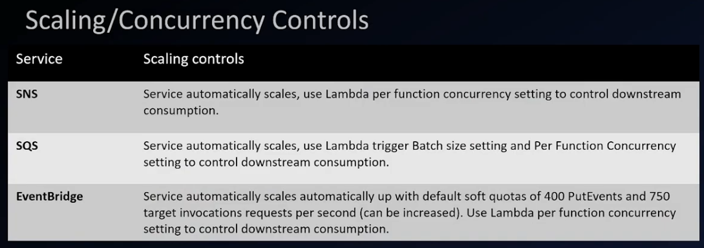
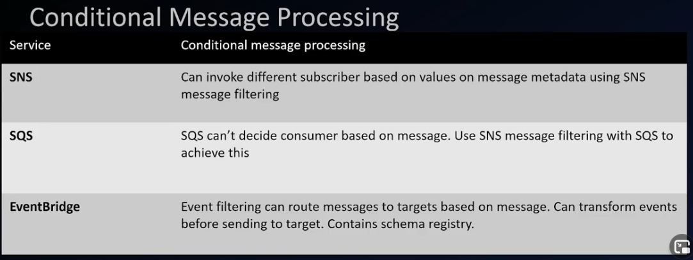
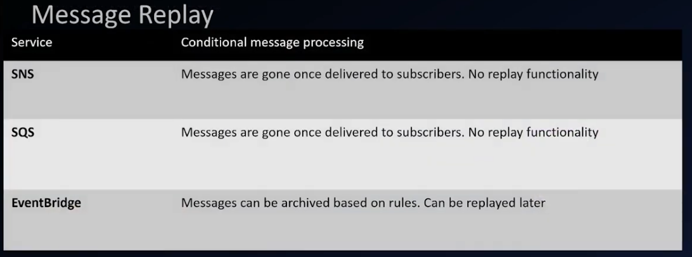
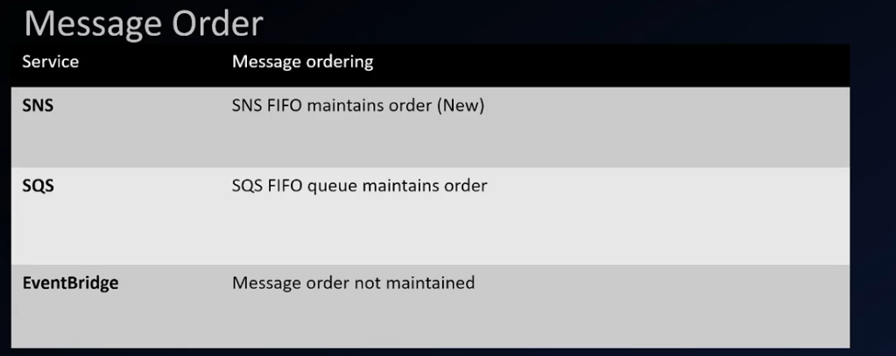
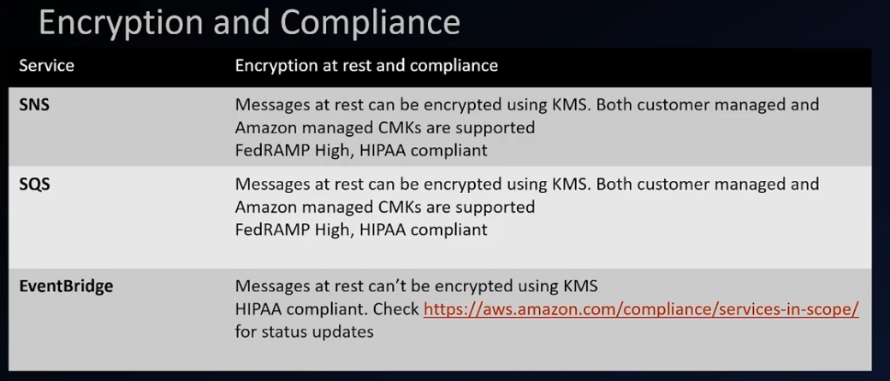
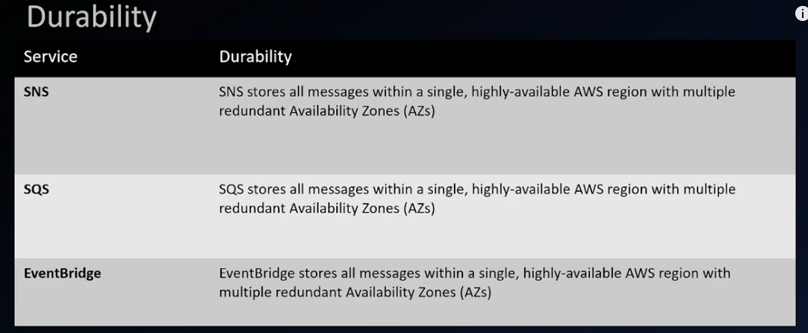
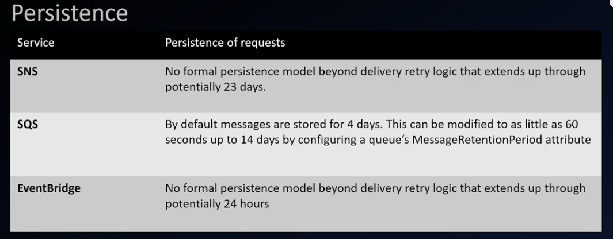
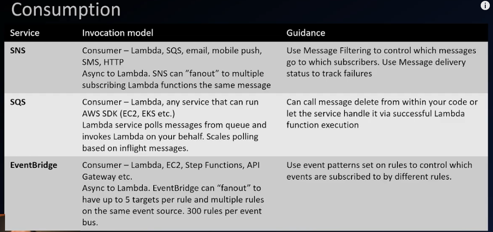
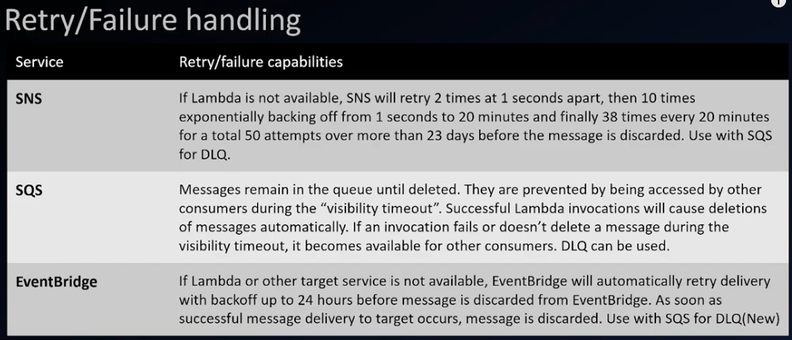

[Go Back](./index.md)

# Compare SQS, SNS, EventBridge
This summary displayes the major differenecs between all 3 message services

#### compare table

### Original Youtube Source

<iframe width="660" height="315" src="https://www.youtube.com/embed/8Vm5IiOT7GY" title="YouTube video player" frameborder="0" allow="accelerometer; autoplay; clipboard-write; encrypted-media; gyroscope; picture-in-picture" allowfullscreen></iframe>
